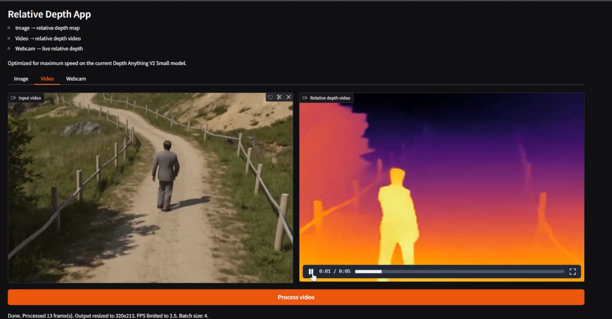
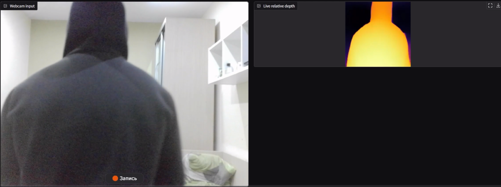
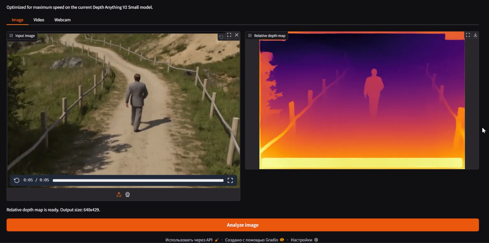

# Lab 7: Monocular Depth Estimation (MDE) App

Complete web app for Monocular Depth Estimation (MDE): convert image, video, and webcam stream into relative depth maps.

Stack: `Gradio + PyTorch + Transformers + OpenCV + Docker`.

## Demo Media

### Video demo (click to open .mp4)

[](captures/video.mp4)

If GitHub video embed is supported in your browser, this block should play inline:

<video src="captures/video.mp4" controls width="960"></video>

## Modes Overview

### 1) Webcam mode (live depth)



- Input: browser webcam stream.
- Output: live relative depth map.
- Optimized for low latency:
  - dedicated fast webcam preprocessing path,
  - `queue=False` for streaming event,
  - `trigger_mode="always_last"` and `concurrency_limit=1` for anti-flicker/backpressure.

### 2) Video mode (file -> depth video)


- Input: uploaded video file.
- Pipeline:
  - decode frames with OpenCV,
  - optional frame sampling (`VIDEO_FPS_LIMIT`),
  - resize (`VIDEO_MAX_SIDE`),
  - batch inference (`VIDEO_BATCH_SIZE`),
  - colorize depth and write output `.mp4`.
- Output: processed depth video.

### 3) Image mode (single image -> depth map)



- Input: uploaded image or webcam snapshot.
- Output: depth heatmap (`COLORMAP_INFERNO`) with original aspect ratio preserved.

## Model and Inference Details

- Primary model: `depth-anything/Depth-Anything-V2-Small-hf`
  - loaded via `AutoImageProcessor` + `AutoModelForDepthEstimation` from Hugging Face Transformers.
- Device:
  - CUDA (`torch.float16`) if GPU is available,
  - CPU (`torch.float32`) fallback.
- Main inference flow:
  - preprocess image(s),
  - forward pass (`torch.inference_mode()`),
  - interpolate predicted depth,
  - normalize per frame,
  - colorize for visualization.
- Relative depth note:
  - output is relative depth, not metric distance in meters.

## Assignment Compliance

### Requirement 1: Working app + trivial deployment wrapper

- Fully working web app with 3 tabs: `Image`, `Video`, `Webcam`.
- Trivial deployment wrapper:

```bash
docker compose up --build
```

### Requirement 2: Functionality/API design is free

- Defined API surface:
  - Gradio UI interactions (tabs/buttons/stream),
  - environment variables for runtime behavior.

## Project Structure

- `app.py` - application logic, model loading, inference, UI.
- `docker-compose.yml` - deployment wrapper and runtime env config.
- `Dockerfile` - container image build.
- `requirements.txt` - Python dependencies.
- `preload_models.py` - optional preloading helper.
- `captures/` - screenshots and demo video.

## Quick Start (Docker, recommended)

### Prerequisites

- Docker Desktop
- Optional: NVIDIA GPU + NVIDIA Container Toolkit for CUDA acceleration

### Run

From `lab7` directory:

```bash
docker compose up --build
```

Open:

```text
http://localhost:7860
```

## Local Run (without Docker)

From `lab7` directory:

```bash
python -m venv .venv
.venv\Scripts\activate
pip install -r requirements.txt
python app.py
```

Then open `http://localhost:7860`.

## How to Use

### Image -> Depth

1. Open `Image` tab.
2. Upload image (or capture from webcam).
3. Click `Analyze image`.
4. Get depth map output.

### Video -> Depth Video

1. Open `Video` tab.
2. Upload video.
3. Click `Process video`.
4. Wait for processing and download/view output.

### Webcam -> Live Depth

1. Open `Webcam` tab.
2. Allow camera access in browser.
3. Watch live depth stream.

## Main Environment Variables

- `PORT` - app port (default `7860`)
- `DEPTH_MODEL_ID` - Hugging Face depth model id
- `IMAGE_MAX_SIDE` - max side for image input
- `VIDEO_MAX_SIDE` - max side for video frames
- `IMAGE_INFER_SIZE` - inference size for image mode
- `VIDEO_INFER_SIZE` - inference size for video mode
- `WEBCAM_INFER_SIZE` - inference size for webcam mode (default `192`)
- `STREAM_EVERY` - webcam stream interval in seconds (default `0.35`)
- `VIDEO_BATCH_SIZE` - batch size for video inference
- `VIDEO_FPS_LIMIT` - max processed FPS for video mode
- `MAX_VIDEO_FRAMES` - max number of processed frames
- `ENABLE_TORCH_COMPILE` - enable `torch.compile` (`0/1`)
- `PERF_LOG` - print aggregated live performance logs (`0/1`)
- `PERF_LOG_EVERY` - perf log period in frames

## Validation Checklist

- App opens at `http://localhost:7860`.
- `Image` tab returns valid depth map.
- `Video` tab returns valid processed video.
- `Webcam` tab streams stable live depth without UI flicker.
